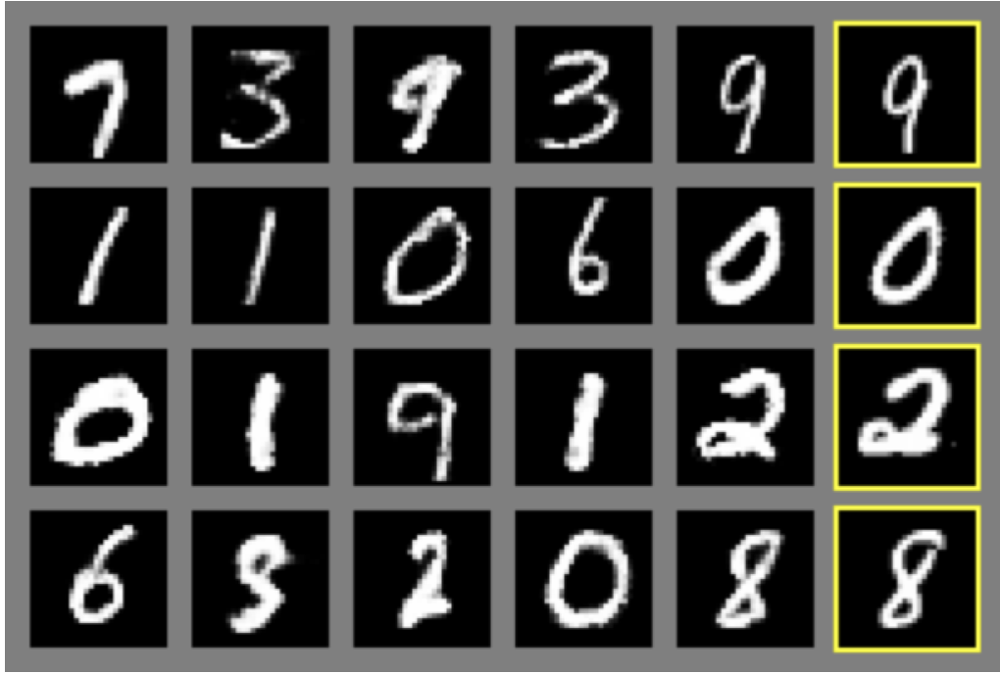
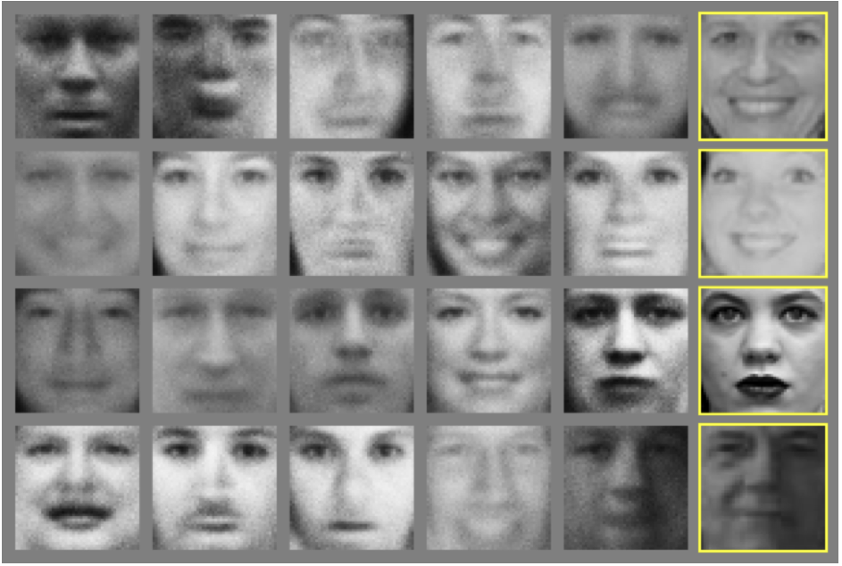
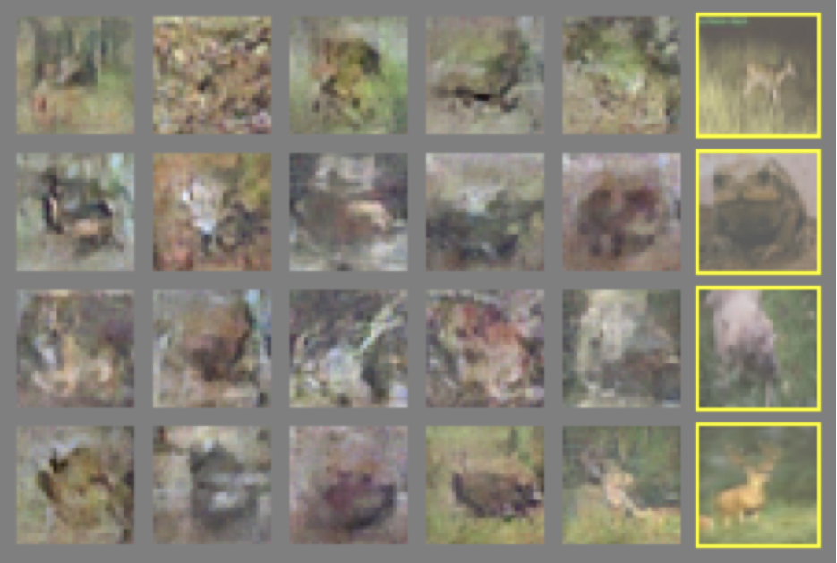
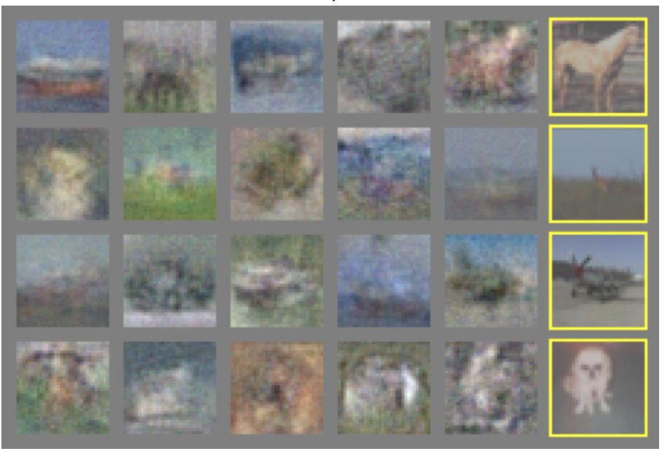
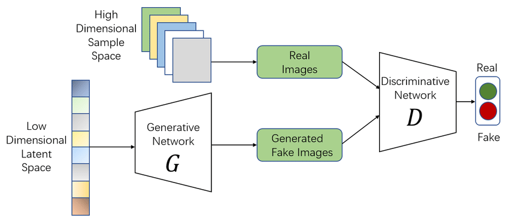
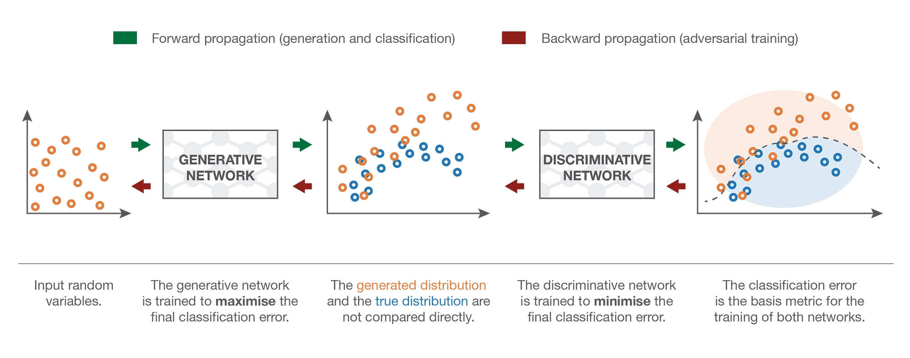

  

# Explaining GANs to your grandmother: a guide

## Introduction

Have you ever wondered how _Generative AI_ works? There are dozens of different methods on how AI can be used to generate new data, like text, images, videos, etc. In the last couple of years, Generative AI researchers have developed many architectures that are not specifically targeted at tackling basic regression/classification problems. Using the same math and principles of already well-established methods, a new field in AI has been born, the generative field.

The idea is very simple: a neural network that generates new data points that are similar to the data points it has been trained on. Basically, new data points that come from the same probability distribution as the training data points.

Let's say we want to create a machine learning model that generates images of dogs. First, we get ourselves a dataset full of them. The images in this dataset can be expressed as samples from an unknown probability distribution. Our model's job is to generate new images that come from the same probability distribution as our training set (new samples of the same distribution). The problem is that we simply don't know this distribution and it's no easy task to figure it out (if even possible).

In order to counter this problem, our model will have its own distribution and our job is to make it as similar as possible to the original one. That's what the training is for. If we manage to do that, then our generated dog images will be very realistic.

There are many different methods to do such a thing, but today I'll explain one of the most popular ones: **GANs** or **Generative Adversarial Networks**.

_Generative Adversarial Networks (GANs)_ are a type of Neural Network created by Ian Goodfellow and his colleagues back in 2014. The **'Generative'** term in its name clearly indicates that this is a type of neural network that generates new data.

This "new data" is not necessarily images. GANs are widely used for many different tasks beyond image generation, such as video, audio/music, and even new molecular structures data generation. They are known for their power and generation quality. Take a look at these images:

  <table>
    <tr>
      <td></td>
      <td></td>
    </tr>
    <tr>
      <td></td>
      <td></td>
    </tr>
  </table>

Each of these images showcases samples generated by a GAN. The rightmost columns are the real images that are the most similar to the generated ones. As you can see, GANs can generate new original data with a very high quality. Let's now explain to your grandma how GANs actually work.

## GANs: What are they, what do they do, and how do they do it?

As you've read above, GANs are a type of Neural Network that generates new data based on the data points it was trained on, but how are they different from vanilla neural networks? GANs are not a special type of network with special types of layers or anything else; they are just a way of making neural networks do something extraordinary. Let's start by analyzing the name and see what we can take from it:

**Generative**: Generates new data points.
**Adversarial**: Competition? One against another?
**Networks**: Neurons, Layers, Weights, Backprop, etc.

**Generative Adversarial Networks** are a set of _two_ neural networks competing with each other. The **Generator** and the **Discriminator**. The first is a neural network that generates new instances of data, while the second is a different neural network that tries to differentiate original instances from AI-generated instances.

The objective of the **Generator** is to generate new samples that are indistinguishable from real ones, fooling the **Discriminator**, which tries to perfectly differentiate real samples from generated ones. That's where the **Adversarial** term comes in; they are competing with each other.

### The Generator Network

The Generator is a network that tries to generate new samples from the same distribution as the data it was trained on.

Our training data is a set of $n$ instances:

$$ \text{training data = }\{x^{(i)}\}_{i=0}^n $$

We want to generate $h$ new samples:

$$ \text{new samples = }\{x^{(j)*}\}_{j=0}^h $$

We want these new $\{x^{(j)*}\}$ samples to follow the same probability distribution as the training data. That's important because we want the generated samples to be representative of the real-world data the model was trained on.

We do this by first sampling a latent random variable $z^{(j)}$ from a known distribution, such as a normal or uniform distribution. Then, we input this latent variable into our network to obtain its output $x^{(j)*}$ (a new, generated sample):

$$ x^{(j)*} = g[z^{(j)}, \theta] $$

Here, $ \theta $ are the parameters of our network.

**Don't forget**: We want our generated samples $\{x^{(j)*}\}$ to be indistinguishable from the real samples $\{x^{(i)}\}$.

In order to train our network to do that, we have a **Discriminator** network.

### The Discriminator Network

The discriminator is a different neural network that classifies a given input as **real** or **fake** (generated by the generator network). It can be represented as:

$$ f[\cdot , \phi] $$

Here, $\phi$ are the parameters for the discriminator network.

It receives an input $x^{(i)}$ and outputs a **probability** that $x^{(i)}$ was generated by the generator. If it's correct (outputs a high probability of a generated sample actually being fake), it gives a signal used to improve the generation process.

### Very Simple Example

Let's say our real data was obtained from a **normal** distribution $N(10, 4)$. We sample a random data point $x^{(i)} = [13.2, 8.7]$

To start our process, we sample a latent random variable $z^{(j)}$ from a **normal** distribution $N(0, 1)$. We got $z^{(j)} = [0.2, -0.7]$

Then, we input $z^{(j)}$ into our generator and get $x^{(j)*}$, where:

$$ x^{(j)*} = g[z^{(j)}, \theta] $$

Let's say our generator is a very simple network like this: $ x^{(j)*} = (x^{(j)} + \theta_1) * \theta_2 $

Initially, where $\theta_1 = 3$ and $\theta_2 = 1$:

$$ x^{(j)*} = (z^{(j)} + \theta_1) * \theta_2 = (z^{(j)} + 3) * 1 = [3.2, 2.3]$$

Now that we have $ x^{(j)*} $, we input it into our discriminator network, which has to classify it as **real** or **fake**. $[3.2, 2.3]$ does not appear to have come from a normal distribution such as $N(10, 4)$, so it would be easy for it to classify $x^{(j)*}$ as **fake**.

Now, a little time has passed, we've trained our generator a bit more and got $\theta_1 = 10$ and $\theta_2 = 1.1$. We input the same $z^{(j)}$ into it and now we have this:

$$ x^{(j)*} = (z^{(j)} + theta_1) * theta_2 = (z^{(j)} + 10) * 2 = [11.22, 10.23]$$

Now, our discriminator will have a much harder time classifying $[11.22, 10.23]$ as **fake** when the real data looks like $[13.2, 8.7]$. They could very well have been sampled from the same distribution. That's the whole point of GANs! Our new, generated sample is very similar to the original ones and that's good. Because if the real ones were dog pictures, the generated ones are as well.

## Training GANs

Training Generative Adversarial Networks is not a simple task. So let's take a look at how it's done step-by-step so your grandmother understands it pretty easily.

### 1. Training the Discriminator

As you've seen, the discriminator is just a binary classifier. It receives a data point as input and needs to classify it as real (drawn from the real data points collection) or fake (created by the generator). This is a very simple binary classification problem and your grandma already knows that, for problems such as this, we use the **binary cross-entropy** as our loss function.

This is the binary cross-entropy loss function:

$$ L_{BCE} = - \frac{1}{n} \sum_{i=1}^n (y_i \cdot\ln{\hat y_i} + (1 - y_i) \cdot \ln{1-\hat y_i}) $$

Don't be scared by it, it's pretty simple. Consider $y_i$ as the answer (or label) for our input, and $\hat y_i$ as the predicted label for this input, by our model. $\hat y_i$ is the estimated probability, given by our model, of $y_i$ being equal to $1$. We want your model to be correct, so we want its prediction $\hat y_i$ to be very close to $1$ (very high probability of $y_i$ being $1$) when $y_i = 1$ and very close to $0$ (very low probability of $y_i$ being $1$) when $y_i = 0$.

Considering the prediction for one single datapoint $i=n$:

- If the answer (label) for this datapoint is $y_n=1$, then:
  - If our model estimated a very high probability of $y_n$ being equal to one (let's say $0.95$), then we calculate the loss as: $$ -(1 \cdot \ln{0.95}) + (1-1) \cdot \ln{1-0.95} = \newline -(1 \cdot \ln{0.95} + 0 \cdot \ln{0.05}) = \newline -(1 \cdot \ln{0.95}) = \newline -\ln{0.95} \approx 0.051 $$
    - Which is very very small, and that's good. We want the loss to be very small, because it means that our model is great.

  - If our model estimated a very low probability of $y_n$ being equal to one ($0.01$), then the loss is: $$ -(1 \cdot \ln{0.01} + (1 - 1) \cdot \ln{1-0.01}) = \newline -\ln{0.01} \approx 4.605 $$
    - Which is very high, and that's bad, because we want the loss to be small.

You see? It's very simple to understand the binary cross-entropy loss. If our model predicts correctly, the loss is very small, otherwise, it's very big.

We are training your discriminator model with the binary cross-entropy loss: If it predicts that a given input has a very high probability of being created by the generator, and this input is in fact fake, its loss will be very small.

In other words, the discriminator is trying to **minimize** the binary cross-entropy loss, like this:

$$ \hat\phi = \argmin_\phi [-\sum_{i=1}^n y_i \cdot \ln{\hat y_i} + (1 - y_i) \cdot \ln{1-\hat y_i}] $$

- This equation means that we are trying to discover the parameters $\phi$ (discriminator's parameters) that will **minimize** the binary cross-entropy. The parameters that are able to do that are given by $\hat\phi$. As simple as that.

### 2. Training the Generator

Ok, now your grandmother knows what the discriminator is trying to do. It's trained to minimize the binary cross-entropy loss and correctly classify every input it receives as either real or fake. But what about the generator?

Remember what we were talking earlier. This is a Generative **Adversarial** Network. So the generator is competing against the discriminator, trying to fool it. You know where I'm trying to get at, right? Your grandma certainly does.

If the discriminator is trying to correctly classify each data point as either real or fake, then the generator is trying to make its adversary make a mistake. Therefore, the generator is trying to **maximize** the binary cross-entropy loss. Like this:

$$ \hat\theta = \argmax_\theta [-\sum_{i=1}^n y_i \cdot \ln{\hat y_i} + (1 - y_i) \cdot \ln{1-\hat y_i}] $$

- This equation means that we are trying to discover the parameters $\theta$ (generator's parameters) that will **maximize** the binary cross-entropy. The parameters that are able to do that are given by $\hat\theta$. As simple as that.

### 3. Putting it altogether

We have two networks: a generator and a discriminator. The discriminator wants to **minimize** the binary cross-entropy loss, while the generator wants to **maximize** this same loss. This is a two-player **_MinMax_** game!

_A MinMax game is a setup where one player is trying to maximize its chances of winning, while the other player is trying to minimize the chances of its opponent winning._

We can translate this MinMax game and give our GAN a single loss function, that encapsulates the objectives of both models, take a look:

$$ \hat\phi, \hat\theta = \argmin_{\phi}[\argmax_{\theta}[-\sum_{i=1}^n y_i \cdot \ln{\hat y_i} + (1-y_i) \cdot \ln{1-\hat y_i}]] $$

This equation is good, but it's not very clear. Let's divide this into two cases:

1. Discriminator evaluates real data
    - Here, $y_i = 1$ and $(1-y_i)=0$, so we have this:
    $$ -\sum_{i=1}^n \ln{\hat y_i} $$
    - Also, knowing that the data is real, we know $\hat y_i$ can be represented as $ \sigma (f[x^{(i)}, \phi]) $. So, our case for when the data is real is this:
    $$ -\sum_{i=1}^n \ln{[\sigma (f[x^{(i)}, \phi])]} $$
2. Discriminator evaluates fake data
    - Here, $y_j = 0$ and $(1-y_j)=1$, so we have this:
    $$ -\sum_{j=1}^m\ln{1-\hat y_j} $$
    - Also, knowing that the data is fake, we know $\hat y_j$ is the output of the generator, so it can be represented as $ \sigma(f[g[z^{(j)}, \theta], \phi]) $. So, our case for when the data is fake is this:
    $$ -\sum_{j=1}^m\ln{[1-\sigma(f[g[z^{(j)}, \theta], \phi])]} $$

Joining this back into one single equation, we have this:

$$ \hat\phi, \hat\theta = \argmin_{\phi}[\argmax_{\theta}[-\sum_{i=1}^n \ln{[\sigma (f[x^{(i)}, \phi])]} -\sum_{j=1}^m\ln{[1-\sigma(f[g[z^{(j)}, \theta], \phi])]}]] $$

This ugly thing in the combination of the of both the Generator and Discriminator losses into one. This simplification (if you call simplification as adding more weird symbols and making it bigger) is called the **MinMax Loss**, a central piece in Generative Adversarial Networks. By this point, your grandma is an expert in GANs.

### 4. The Training Loop

Now that we have a loss function, let's see how everything really works.

So, we have two neural networks that are training simultaneously: the Generator and the Discriminator. The generator's input is a random latent variable, sampled from a standard probability distribution, such as the Normal or Uniform distribution, which is chosen by the user at the beginning of the training loop. Each latent variable will be inputted into the Generator, which will output a new generated sample.

The Discriminator will receive one of two inputs: either a real data point sampled from the training data (a real dog image, for example) or a generated sample that just came out of the generator. The discriminator's output will be the probability of this sample being fake (ranging from 0 to 1). From the discriminator's output, the loss will be calculated and the weights of both networks will be updated based on the result of the turn.

Note: Only one sample (either real or fake) will be given to the discriminator at a time.

Take a look at this image that explains our training setup:

As you can see from the image, the latent random variable is not in the same shape as the real samples. It's the Generator's job (often a convolutional network) to transform this random variable into a variable with the same shape as the real data.

Take a look at this other image that explains a bit more about what happens during training:

Looking at this graph, it's easy to realize why we need the generated samples to be as similar as possible to the real samples. The closer they are, the harder time the discriminator will have classifying each input as either real or fake. In this case, if the real samples are images of dogs, then the generated samples should be very convincing images of dogs. That's exactly what we want.

Let's get a bit deeper. Take a look at the training loop:

#### Training Loop for GANs

-------------------------------------

**for** number of training iterations **do**

  - **for** steps **do**

    - sample $\text{m}$ noise samples $\{z^{(1)}, ...,z^{(m)}\}$ from noise prior $p_g(z)$
    - sample $\text{m}$ real data points $\{x^{(1)}, ...,x^{(m)}\}$ from generating distribution $p_{\text{data}}(x)$
    - update the discriminator throught gradient descent: 
    $ \frac{\partial}{\partial_\phi} \frac{1}{m}\sum_{i=1}^m [\ln{(\sigma{(f[x^{(i)},\phi])})} + \ln{(1 -\sigma(f[g[z^{(i)}, \theta], \phi]))}]$ 
  
  $ \newline $
  - **end for**
  - sample $\text{m}$ noise samples $\{z^{(1)}, ...,z^{(m)}\}$ from noise prior $p_g(z)$
  - update the generator throught gradient descent:
  $ \frac{\partial}{\partial_\theta} \frac{1}{m} \sum_{i=1}^{m} [\ln{(1 -\sigma(f[g[z^{(i)}, \theta], \phi]))}]$ 

**end for**

-------------------------------------

**Important Notes from the training loop:**

- The noise prior distribution $p_g(z)$ is the data distribution where the latent random variables $ z $ come from. This is chosen by the user and is usually a Normal or Uniform distribution.
- The generating distribution $p_{\text{data}}(x)$ is the distribution of the real data. We don't know this distrubution. It's the one we are trying to approximate with our generator model.
- The inner loop (**steps**) is the number of times you update the discriminator's weights before you start updating the generator's weights. No, you don't need to update them in the same rythm.

So this is how GANs actually work. This is how they are trained and how they generate very high quality samples.

## References

- [1] "Generative Adversarial Networks - Wikipedia". Available at: [https://en.wikipedia.org/wiki/Generative_adversarial_network](https://en.wikipedia.org/wiki/Generative_adversarial_network)

- [2] "Generative Adversarial Networks Explained - YouTube". Available at: [https://www.youtube.com/watch?v=Gib_kiXgnvA&list=WL&index=11&t=396s](https://www.youtube.com/watch?v=Gib_kiXgnvA&list=WL&index=11&t=396s)

- [3] "Understanding Generative Adversarial Networks (GANs) - Towards Data Science". Available at: [https://towardsdatascience.com/understanding-generative-adversarial-networks-gans-cd6e4651a29](https://towardsdatascience.com/understanding-generative-adversarial-networks-gans-cd6e4651a29)

- [4] "GAN Structure - Google Developers". Available at: [https://developers.google.com/machine-learning/gan/gan_structure](https://developers.google.com/machine-learning/gan/gan_structure)

- [5] "Generative Adversarial Networks Explained - IBM Developer". Available at: [https://developer.ibm.com/articles/generative-adversarial-networks-explained/](https://developer.ibm.com/articles/generative-adversarial-networks-explained/)

- [6] Ian J. Goodfellow et al. "Generative Adversarial Networks". arXiv:1406.2661 [cs.LG]. Available at: [https://arxiv.org/abs/1406.2661](https://arxiv.org/abs/1406.2661)
